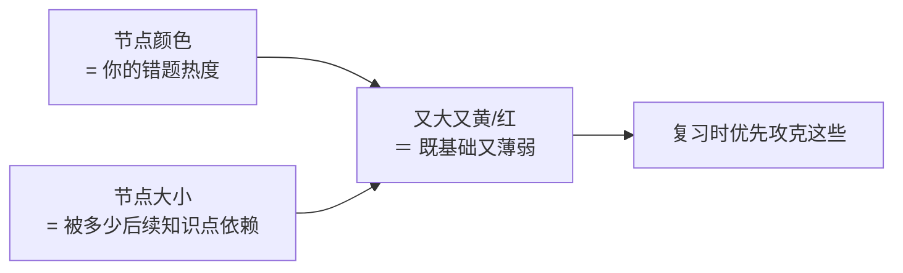

# StudyBuddy · 知识图谱版

基于本项目已有的高中数学知识图谱（544 个知识点 / 776 条关系 / 12 个模块），
做一个**拍照上传错题 → 自动识别 → 匹配知识点 → 记录并统计薄弱点**的网页应用。

---

## 快速开始

```bash
# 1. 安装依赖（清华镜像）—— 用哪个 Python 就装到哪个环境
python -m pip install -i https://pypi.tuna.tsinghua.edu.cn/simple \
    fastapi "uvicorn[standard]" python-multipart requests jsonschema pillow pymupdf

# 2. 构建图谱快照（首次必须运行，之后图谱有更新再跑）
python -m app.mathkg.build_index

# 3. 启动
python run.py
# → 打开 http://127.0.0.1:8000
```

### 关于用哪个 Python（Windows 上最容易踩的坑）

如果报 `ModuleNotFoundError: No module named 'fastapi'`，说明当前 `python`
不是装了依赖的那个（常见于 conda base 抢占 PATH）。两种情况都能解决：

```bash
python run.py            # 推荐：启动器会自动找到装了依赖的解释器并切过去
```

或直接指定解释器（项目自带 `.venv` 依赖已齐全）：

```bash
.venv\Scripts\python.exe -m app.server        # PowerShell / CMD
# 或先激活再用 python
& .\.venv\Scripts\Activate.ps1
python -m app.server
```

`run.py` 会依次检查：当前解释器 → 项目 `.venv` → conda `accountant` 环境；
都不行时会打印可直接复制的安装命令，不会留下一个看不懂的报错。

> 首次打开是「离线样例模式」，界面可以完整走通，但识别结果是假的。
> 要接真实识图模型，见下一节。

可选：写入一组演示错题，方便先看效果

```bash
python -m app.tests.seed_demo          # 学生 id = demo
python -m app.tests.seed_demo --clear  # 清空演示数据
```

---

## 接入 DeepSeek 识图模型

复制 `.env` 模板并填三项即可，**代码不用改**：

```bash
cp app/.env.example app/.env
```

```ini
VISION_PROVIDER=deepseek
VISION_API_BASE=https://api.deepseek.com/v1
VISION_API_KEY=sk-你的密钥
VISION_MODEL=你的识图模型名称      # ← 填 DeepSeek 控制台里看到的名称
```

填完先自检，不用打开网页：

```bash
python -m app.tests.check_vision               # 配置 + 连通性
python -m app.tests.check_vision --image       # 用自动生成的数学题图片实测识图
python -m app.tests.check_vision 我的错题.jpg  # 用你自己的图片/PDF 实测
```

会顺便告诉你识别出了几道题。乱码、公式没转成 LaTeX、多题没拆开，这里能一眼看出来。

`VISION_API_BASE` 走的是 OpenAI 兼容的 `/chat/completions` 协议，
所以换成通义千问、智谱、或本地 Ollama（`http://127.0.0.1:11434/v1`）都只需要改这三行。

### 长 PDF 是按页识别的

上传多页 PDF 时，会**一页一次请求**分别识别再合并，而不是把整本塞进一次请求。
这样做的好处：

- 页数多也不会超出上下文（整本塞进去时模型会忽略后面的页，表现为「只扫描了第一页」）
- 个别页识别失败不影响其它页，会在界面上告警
- 每道题都带页码，勾选时能看到「第几页的哪道题」

页数上限由 `VISION_MAX_PAGES` 控制（默认 50，`<=0` 不限）。
注意这个值设小了会**静默漏掉后面的页**，超出时会在告警里提示。

这些请求是纯 I/O 等待，所以默认用线程池并发发出（`VISION_CONCURRENCY`，默认 4）。
实测 4 页 PDF：并发后整本 **6 秒**完成。

### 推理型模型要把 token 预算调大

DeepSeek 的 `deepseek-flash` / `deepseek-reasoner` 属于**推理型模型**：
它会先在 `reasoning_content` 里写思考过程，然后才输出正文 `content`。
预算给小了会出现「返回成功但内容是空的」这种假故障。默认值已设为 8192：

```ini
API_MAX_TOKENS=8192
```

代码里对这种情况有专门的报错提示，不会让你对着一个空字符串发呆。

> 模型名不确定时，先把 `VISION_PROVIDER` 留成 `mock`，
> 用「手动输入题干」的方式把流程跑通，再补上模型配置。

---

## 使用流程

1. **录入** — 拍照/截图（可多张：题目 + 你的解答），或直接粘贴题干文字
2. **识别** — 识图模型把题目转成结构化数据（公式转 LaTeX、保留原图、识别手写作答）
   - **一页多题会自动拆开**：上传整页试卷/练习册时，会先列出识别到的所有题目，
     让你勾选这次要记录哪几道，**没勾选的不会进错题本**
3. **抽知识点** — 文本模型给出候选知识点名，**再由确定性算法**对齐到图谱真实编号
   - 过程会实时显示进度（按页识别 → 逐题抽取 → 图谱对齐 → AI 解析）
4. **确认** — 置信度不足的匹配会列出候选，由学生勾选（模型不给结论，算法给证据）
5. **落库** — 保存题干、原图、知识点、AI 答案与分步解析、错因归类
6. **统计** — 知识点错题热度分级、模块薄弱概览、复习优先级
7. **看图** — 图谱视图里按热度着色，一眼定位「既基础又薄弱」的枢纽知识点

## 五个页面

| 页面 | 作用 |
|---|---|
| ① 录入错题 | 拍照/截图/粘贴题干 → 识别 → 对齐 → 入库 |
| ② 错题本 | 按知识点或错因筛选错题卡片，查看 AI 解析、重新分析、标记订正 |
| ③ 知识点热度 | 热度分级表 + 模块薄弱概览 + 复习优先级清单 |
| ④ 图谱查询 | 关键词检索知识点，看规范陈述、前置/后继、一键生成学习路径 |
| ⑤ 图谱视图 | 知识图谱可视化，**颜色＝错题热度，大小＝被依赖数** |

### 图谱视图怎么读



- 视图范围可选「按册 / 按模块 / 全部」；默认打开必修第一册（113 个节点，布局快）
- 节点标签只显示**有错题的**和**枢纽**节点，避免 100+ 标签挤成一团
- 点击节点 → 右侧展开该知识点的陈述、前后置、相关错题，并可「以它为中心展开」（前后各 2 层）
- 画面会在 1.2s / 3s / 6s 自动适配三次（力导向布局需要几秒才铺开），
  用户一旦拖拽或缩放就立即停止，不跟人抢控制权

---

## 数据分层（重要）

| 数据 | 位置 | 读写 |
|---|---|---|
| 本体图谱（知识点、关系） | `ontology/data/src/**` | **只读**，应用永不写入 |
| 图谱快照（供应用查询） | `app/data/kg_snapshot.json` | 由 `build_index` 生成 |
| 学生数据（题目、错题、掌握度） | `app/data/db.sqlite` | 读写 |
| 题目原图 | `app/data/assets/{学生}/{年-月}/{题号}/` | 读写 |

这样做的原因见《本体规范》原则 P6「静态图谱与动态数据分离」：
学生数据是私有的、会变的；图谱是公共的、受校验约束的。混在一起会让两边都难维护。

---

## 目录结构

```
app/
├─ config.py             配置与路径（合并 pipeline/.env 与 app/.env）
├─ server.py             FastAPI 服务（错题本 + 图谱查询）
├─ mathkg/               图谱引擎：纯 Python、确定性、可单测
│   ├─ build_index.py      聚合 24 个 JSON → kg_snapshot.json
│   ├─ store.py            快照加载 + 图索引 + 检索索引 + 教材原文回链
│   ├─ textutil.py         中文归一化 / n-gram / 主题标签判别
│   ├─ search.py           字段化 IDF 检索打分
│   ├─ graph.py            前置子图、拓扑排序、学习路径、根因下钻
│   └─ link.py             知识点对齐（候选名 → 图谱真实 ID）★核心
├─ wrongbook/
│   ├─ vision.py           识图适配层（OpenAI 兼容 / mock）
│   ├─ analyze.py          LLM 提示词：抽知识点、AI 解答与错因分析
│   ├─ pipeline.py         端到端编排（识别→抽取→对齐→落库→分析）
│   ├─ store.py            SQLite 读写与统计
│   └─ stats.py            热度分级、模块概览、复习优先级
├─ static/               网页前端（原生 JS + 离线 KaTeX，无构建步骤）
├─ data/                 运行时数据（快照、数据库、图片）
└─ tests/                冒烟测试
```

---

## 关键设计说明

### 为什么知识点对齐不用 LLM 直接产出 ID

模型会编造 `KP-FUNC-0099` 这种不存在的编号。所以流程是
**LLM 只提候选名 → 确定性算法落地 ID**：

```
候选名 → 归一化 → 名称/别名精确匹配 → 主题标签匹配 → 字段化 IDF 打分
       → 阈值分流（≥0.80 自动采用 / 0.45–0.80 需确认 / <0.45 图谱外）
```

### 检索为什么不用余弦相似

`statement` 长达 200 字，占几百个 n-gram，余弦要除以整体模长，
会把「只命中一个标签」的短匹配稀释到 0.28 以下，导致「奇偶性」这类上位词检索失败。
改用字段化饱和归一化：

$$\text{score} = \frac{\sum_g \text{idf}(g)\cdot w_{kp}(g)}{K + \sum_g \text{idf}(g)\cdot W_{max}}$$

命中名称的词快速饱和，命中陈述的词贡献很小，符合「名称 > 别名 > 标签 > 陈述」的直觉。

### 什么是「主题标签」

图谱的 931 个标签里混着两类东西：知识主题（`奇偶性`、`单调性`）和题面用语
（`取值范围`、`分类讨论`）。后者在任何题里都可能出现，用来召回会大量误报。

判别办法（数据驱动，无需维护停用词表）：**知识主题必然出现在某些知识点名称里**，
题面用语不会。于是取「标签 ∩ 知识点名称的 n-gram」，931 个标签筛出 372 个主题标签。

### 弱证据不冒充高置信

没有配置模型时会退化为「词典匹配」：题干里出现了知识点名称/别名/标签就召回。
但「题干提到了它」不等于「这道题考它」，所以这类匹配的置信度被封顶：

| 证据 | 置信度上限 | 效果 |
|---|---|---|
| 题干出现完整知识点名称 | 0.82 | 可自动采用 |
| 题干出现别名 | 0.62 | 需确认 |
| 题干出现标签 | 0.52 | 需确认 |

---

## API 一览

| 方法 | 路径 | 说明 |
|---|---|---|
| GET | `/api/health` | 图谱统计 + 识别环境自检 |
| POST | `/api/ingest` | 录入错题（同步，适合脚本/测试） |
| POST | `/api/ingest_async` | 录入错题（异步，立即返回 `job_id`） |
| POST | `/api/ingest_commit` | 勾选后入库（`{job_id, picks}`，**复用已识别结果，不重传文件**） |
| GET | `/api/jobs/{job_id}` | 查询录入进度（`state` / `percent` / `message` / `result`） |
| GET | `/api/wrongbook` | 错题列表（可按知识点/错因筛选） |
| GET | `/api/wrongbook/{id}` | 错题详情（含根因候选） |
| POST | `/api/wrongbook/{id}/confirm` | 保存学生对知识点的确认 |
| POST | `/api/wrongbook/{id}/analyze` | 重新生成 AI 解答与错因 |
| POST | `/api/wrongbook/{id}/resolve` | 标记已订正 |
| GET | `/api/heatmap` | 知识点错题热度（含分级颜色） |
| GET | `/api/module-summary` | 模块薄弱概览 |
| GET | `/api/review-plan` | 复习优先级清单 |
| GET | `/api/search` | 知识点检索 |
| GET | `/api/kp/{id}` | 知识点详情（前置/后继/关联错题） |
| GET | `/api/graph` | 可视化子图（`book` / `module` / `focus`+`depth`），节点带错题热度 |
| GET | `/api/books` | 教材册列表（含各册知识点数） |
| GET | `/api/path` | 学习路径（拓扑排序 + 每步理由） |
| GET | `/api/root-cause` | 由错题知识点下钻根因 |

交互式接口文档：启动后访问 `/docs`。

---

## 测试

```bash
python -m app.tests.smoke_mathkg        # 图谱引擎（检索/对齐/路径/诊断）14 项
python run.py --port 8010               # 另开一个终端启动服务
python -m app.tests.smoke_web http://127.0.0.1:8010   # Web 端到端 14 项
```

两个环境都验证过：conda `accountant`（Python 3.12）与项目 `.venv`（Python 3.13）。

---

## 已知限制

1. **识别质量依赖模型**：`mock` 模式只是占位，真实效果取决于所配识图模型对手写体与公式的能力。
2. **未配模型时功能受限**：会退化为词典匹配，只能召回题干里直接出现的知识点，
   像「求边 $c$」这种不点名的题目会匹配不到。
3. **AI 解答需人工把关**：解析由模型生成并已限定在图谱知识点与教材原文范围内，
   但仍属于「AI 生成内容」，界面会明确标注来源编号，请以教材为准。
4. **图谱本身全部为 `draft` 状态**：内容尚未逐条人工审核，界面上带出处回链以便核对。
5. **题库未启用**：本体规范里的 `Question` / `TESTS` 关系仍是 V1.1 计划，
   当前的错题记录全部存在应用侧数据库，不进图谱。

---

## 内存中的任务表

异步录入的任务状态存在**进程内存**里（`app/progress.py`），所以：
- 多 worker 部署（`uvicorn --workers 4`）时各进程不共享任务表，需要的话换成 Redis；
- 本应用是单进程本地服务，够用；任务完成后保留 1 小时，自动清理。

前端默认走 `/api/ingest_async` + 轮询（每 0.9 秒），所以整页试卷识别几分钟也不会「界面卡死」。
命令行和测试沿用同步的 `/api/ingest`。

进度会**同时显示在两处**：左侧控制区的进度条，以及右侧「识别结果」卡片里的进度面板。
后者是必须的 —— 点完「记录选中的题」之后用户的视线就在结果卡片上，
只更新左侧等于没显示（这是实际使用中暴露出来的问题）。
若入库失败，勾选清单会自动恢复，可直接重试而不用重新上传。

## 勾选入库为什么不能重新识别

一张试卷图里往往有多道题，学生勾选后才入库。早期实现是「勾选后重新上传 + 重新识别」，
两个问题：

1. **慢** —— 整页 PDF 要再跑一遍分页识别；
2. **可能对不上** —— 模型不是确定性的，重跑可能给出与勾选时**不一样的题目**，
   于是「勾选的是第 5 题，入库的却是另一道题」。

现在的做法：识别阶段就把每页图片暂存到 `app/data/pending/{job_id}/`，
完整题目（含图片路径）留在服务端任务缓存里；`/api/ingest_commit` 只传 `{job_id, picks}`，
直接复用那批题目，并把对应页的图片复制成每道题自己的资源。

> 顺带的好处：每道题拿到的是**它自己那一页**的图，而不是整份 PDF。

逐题处理也是并发的（每题一次模型调用，纯等待），并发度由 `TASK_CONCURRENCY` 控制（默认 4）。
并发时百分比只由「已完成几道」驱动 —— 否则后一道题的起始百分比会把进度条直接拉过去，
前面那道题的进展就再也显示不出来（实测条会卡在 55% 不动）。

## 后续可做

- **错题导出为私有题库**：走 `validate_kg.py` 闸门，把优质题目"捐"进 V1.1 的 `Question` 层
- **重做闭环**：间隔重复排期（按热度 + 前置可解锁性）
- **多学生/家长视图**：目前 `student_id` 只是一个字符串，没有鉴权
- **补 `CONFUSED_WITH` 易混淆关系**：现在为 0，可从「同 tags 且都是 concept 类型」共现推导候选，人工确认后回写图谱

> 关于原始的 `ontology/build/graph/knowledge-graph.html`：那个文件是本体构建产物，
> 保持只读、不掺入学生数据。应用侧的图谱视图（`/api/graph` + ⑤ 页面）是在
> 快照上实时叠加热度，两者互不干扰 —— 这是《本体规范》P6「静态图谱与动态数据分离」的落实。
